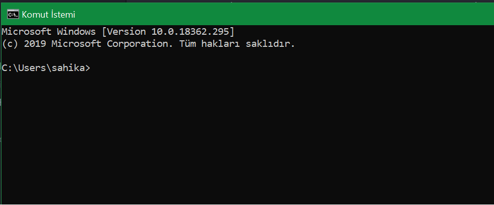
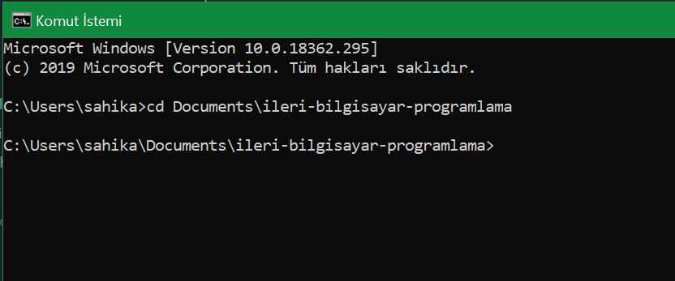
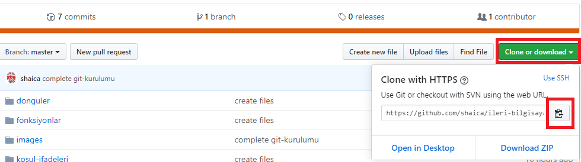
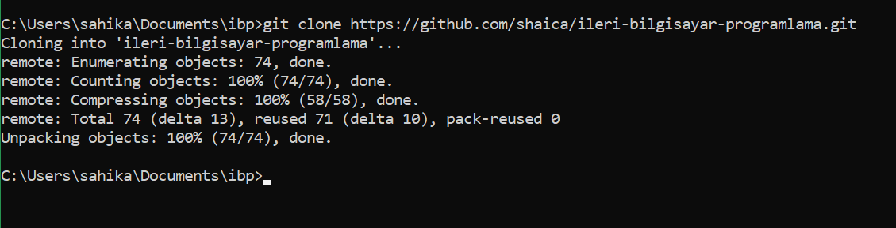
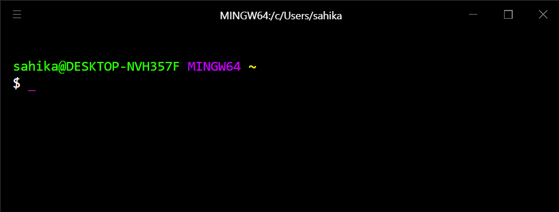
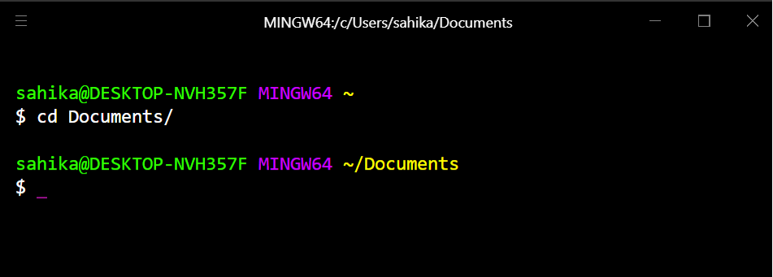
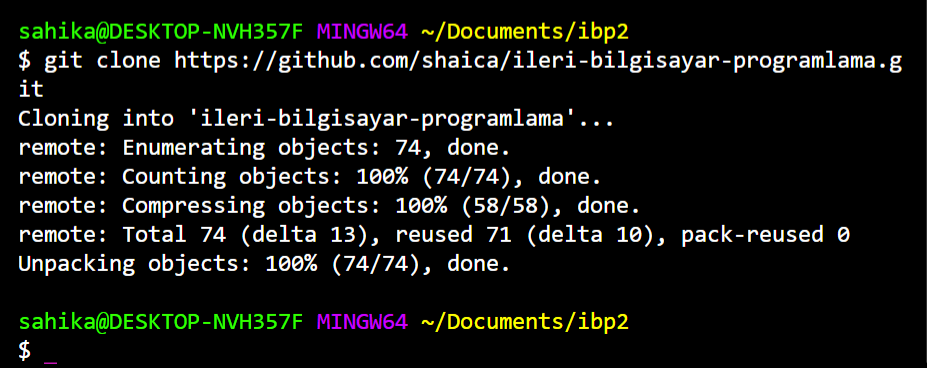
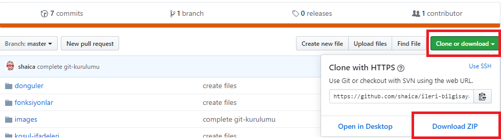

# Ders Dosyalarını İndirme

Program kurulumlarını yaptıktan sonra ders dosyalarını indirmek için aşağıdaki işlemleri takip ediniz.

## Git Bash ile ders dosyalarının indirilmesi

Komut istemini açınız. Hyper komut istemini indirdiyseniz Hyper'ı açınız.

### Komut istemi ile dosyaları indirme

Komut istemi kullanıyorsanız açılışta ekran aşağıdaki gibi gözükmelidir. C:\Users\\**kullanıcı-adınız**



1. Eğer ekrandaki dizin C:\Users\\**kullanıcı-adınız** bu şekilde gözükmüyorsa aşağıdaki kodu sırayla yazıp enter'a basınız.
```
cd \
cd Users\kullanıcı-adiniz
```

2. Doğru dizine geldikten sonra aşağıdaki kodu yazıp enter'a basınız. Bu kod sizi Belgelerim klasörüne götürecektir.

```
cd Documents
```



3. [GitHub/ileri-bilgisayar-programlama](https://github.com/shaica/ileri-bilgisayar-programlama) sayfasını açınız ve **Clone or Download** menüsüne tıklayınız. Açılan menüde adresin sonunda bulunan kopyalama simgesine tıklayınız.



4. Komut istemi ekranına aşağıdaki kodu yazıp enter'a basınız. **Adresi komut ekranına sağ tıklayarak yapıştırabilirsiniz.**

```
git clone https://github.com/shaica/ileri-bilgisayar-programlama.git
```
5. İşlem tamamlandığında aşağıdaki gibi gözükecektir:



Belgelerim klasörünüzün altında **ileri-bilgisayar-programlama** klasörünü bulabilirsiniz.

### Hyper ile dosyaları indirme

Hyper kullanıyorsanız açılışta ekran aşağıdaki gibi gözükmelidir. **kullanıcı-adiniz**@**bilgisayar-adi** MINGW64 ~



1. Eğer ekrandaki dizin **kullanıcı-adiniz**@**bilgisayar-adi** MINGW64 ~ bu şekilde gözükmüyorsa aşağıdaki kodu sırayla yazıp enter'a basınız.
```
cd ~
```
2. Doğru dizine geldikten sonra aşağıdaki kodu yazıp enter'a basınız. Bu kod sizi Belgelerim klasörüne götürecektir.
```
cd Documents/
```



3. [GitHub/ileri-bilgisayar-programlama](https://github.com/shaica/ileri-bilgisayar-programlama) sayfasını açınız ve **Clone or Download** menüsüne tıklayınız. Açılan menüde adresin sonunda bulunan kopyalama simgesine tıklayınız.


4. Komut istemi ekranına aşağıdaki kodu yazıp enter'a basınız. **Adresi komut ekranına sağ tıklayarak yapıştırabilirsiniz.**

```
git clone https://github.com/shaica/ileri-bilgisayar-programlama.git
```
5. İşlem tamamlandığında aşağıdaki gibi gözükecektir:



Belgelerim klasörünüzün altında **ileri-bilgisayar-programlama** klasörünü bulabilirsiniz.

# ZIP Dosyası olarak indirme

1. [GitHub/ileri-bilgisayar-programlama](https://github.com/shaica/ileri-bilgisayar-programlama) sayfasını açınız ve **Clone or Download** menüsüne tıklayınız. Açılan menüde **Download ZIP** linkine tıklayınız.



2. İndirilenler klasörünüzde ZIP dosyasını açınız.
3. Klasör içeriğini Belgelerim altında oluşturduğunuz **ileri-bilgisayar-programlama** klasörünün içine sürükleyip bırakınız.

Belgelerim klasörünüzün altında **ileri-bilgisayar-programlama** klasörünü bulabilirsiniz.
