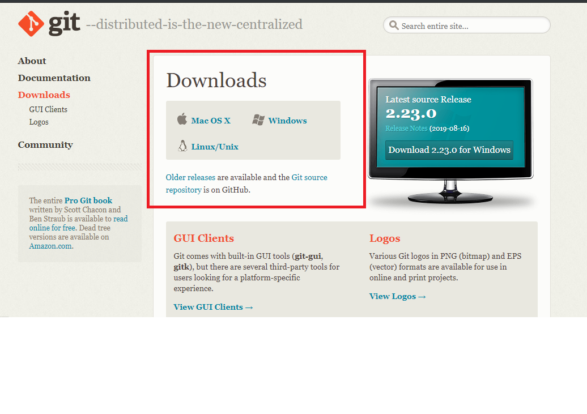

# git-bash Kurulumu

## Git nedir?

**Git**, versiyon kontrolünü sağlayan ve komut istemi üzerinden kullanılabilen bir programdır.

Peki bu ne demek?

Diyelimki bir ödev hazırlıyorsunuz. Başta her şey çok güzel ve **odev.doc** diye bir dosyanız var. Üzerinde çalıştıkça dosyayı kaydediyorsunuz ve bazen de **odev-son.doc**, **odev-son-son.doc** gibi aynı dosyanın çalışılmış kopyalarını çeşitli sebeplerden kaydediyorsunuz. Neticede elinizde artık kaç tane ödev dosyası olduğunu ve bunlardan hangisinin en güncel olduğunu ya da doğru değişikliği doğru dosyada mı yaptığınızdan emin olamıyorsunuz. Bunun çözümü *versiyon kontrolü* denilen bir yöntem.

Versiyon kontrolü yaparak her dosyadan sadece 1 tane oluşturmanız yeterli. **git** yaptığınız değişiklikleri özel bir dosyada takip edip kaydını tutuyor. Böylece siz de istediğiniz zaman adeta zamanda geriye gidip dosyanızın eski hallerine bilgi kaybı olmadan ulaşabiliyorsunuz. Dosyanızın en son halini geçmiş versiyonlarından herhangi biriyle karşılaştırabiliyor ve daha birçok şey yapabiliyorsunuz.

Versiyon kontrolünü sadece komut istemi üzerinden yapmak zorunda değilsiniz. [GitHub](www.github.com)'un kullanıcı arayüzüne sahip programını da kullanabilirsiniz. (Kurulumu aşağıda!)

Çalışmalarınızı [GitHub](www.github.com) sitesinde bulutta da saklayabilirsiniz. Böylece bilgisayarınıza bir şey olsa bile, hem bütün dosyalarınız güvende olur hem de bütün geçmiş versiyonları da korunmuş olur. GitHub öğrencilere öğrenci oldukları süre boyunca bütün özelliklerinden ücretsiz olarak faydalanma imkanı sağlıyor. Ayrıca birçok başka program ve servisi de *öğrenci paketi* ile ücretsiz kullanımınıza açıyor.

> Kısaca sadece bu ders için değil, gelecekteki bütün çalışmalarınız için git'i kullanmanız şiddetle tavsiye olunur. Sizi birçok baş ağrısından kurtaracağına emin olabilirsiniz.

## Git Bash Kurulumu

1. [Git websitesi](https://git-scm.com/downloads) linkine tıklayınız.
2. İşletme sisteminizin üzerine tıklayarak indirme işlemini başlatın.

3. Kur dosyasına tıklayıp kurulum programını başlatın.
4. Hiçbir değişiklik yapmadan **Next**'e tıklayarak kurulumu tamamlayın.

Kurulum sonunda bilgisayarınızın başlat klasöründe **Git** adı altında bir klasör bulacaksınız. İçinde **Git Bash** ve **Git GUI** programları olacak. Git Bash komut istemine alternatif olarak kullanabileceğiniz bir komut istemi. Git GUI de basit bir arayüze sahip versiyonu. Kullanımıyla ilgili ayrıntılı bilgiyi [git](pythona-giris/git.ipynb) dosyasından ulaşabilirsiniz.

## GitHub Desktop Kurulumu

1. [GitHub Desktop Websitesi](desktop.github.com) linkine tıklayın.
2. İşletim sisteminize uygun kur dosyasını indirin ve çalıştırın.
3. İsterseniz yeni bir github hesabı oluşturabilirsiniz, hesabınız varsa giriş yapabilirsiniz veya bu aşamayı atlayabilirsiniz.

4. GitHub desktop programınız kullanıma hazır.

> GitHub Desktop kullanımı için bu ders notlarında ayrıntılı bilgi verilmeyecektir. Programın kendi dökümantasyonu ayrıntılı ve anlaşılır bir şekilde bulunmaktadır. [Buradan ulaşabilirsiniz.](https://help.github.com/en/desktop/getting-started-with-github-desktop)
