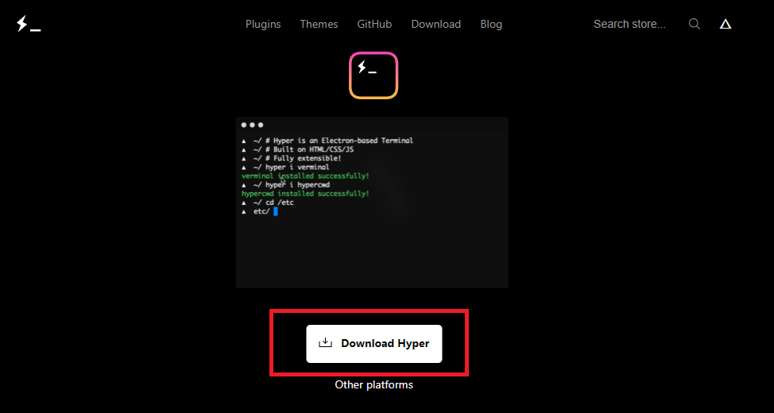
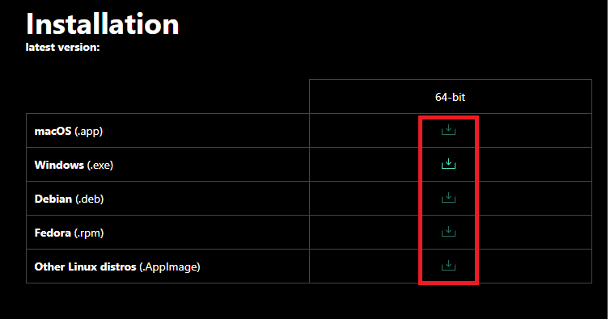
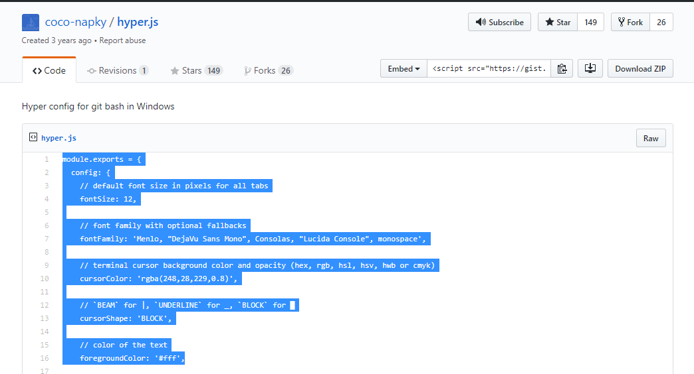
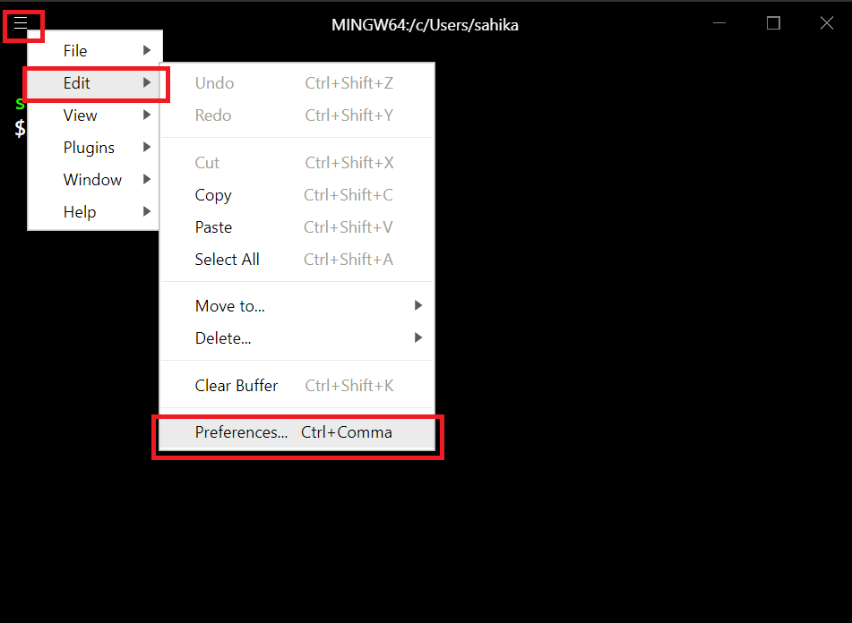
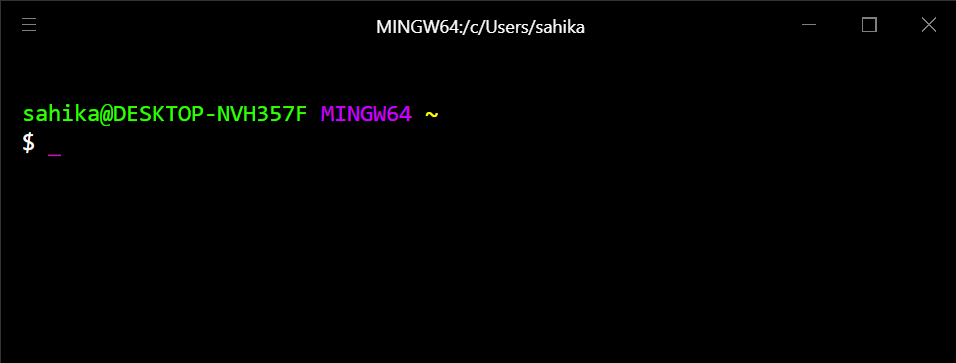

# Hyper Kurulumu

Kullanım kolaylığı açısından Windows Command Line (Windows Komut İstemi) yerine Hyper kullanmanız tavsiye edilir.

Hyper kurulumunu yapmak için işletim sisteminize uygun olan aşağıdaki işlemleri takip ediniz.

1. [Hyper Websitesi](hyper.is)'ni açınız.

2. **Download Hyper** linkine tıklayınız.

3. Açılan indirme sayfasından işletim sisteminize uygun olan linke tıklayarak indirme işlemini başlatınız.

## Windows Kurulumu

1. İndirilen kur dosyasına tıklayınız.
2. Hyper terminali ekranınızda açıldığında bilgisayarınıza yüklenmiş demektir.
3. Hyper Ayarlarını yapmak için linke [tıklayınız.](https://gist.github.com/coco-napky/404220405435b3d0373e37ec43e54a23)
4. Açılan sayfadaki kodun hepsini seçip kopyalayınız.

5. Hyper üst menüsünün en solunda bulunan menü tuşuna tıklayıp, Edit>Preferences ayarına giriniz.

6. Açılan not defteri dosyasındaki her şeyi silip, web sitesinden kopyaladığınız her şeyi yapıştırınız. Kaydedip kapatınız.
7. Hyper terminali kapatıp yeniden açınız. Aşağıdaki gibi bir ekran görmelisiniz. Hyper'ı kullanmaya başlayabilirsiniz.

# MacOS Kurulumu

1. İndirilen kur dosyasına tıklayınız.
2. Klasöre çıkan Hyper uygulamasını **Uygulamalar** (**Applications**) klasörüne sürekliyip bırakınız.
3. Hyper'ı kullanmaya başlayabilirsiniz.
