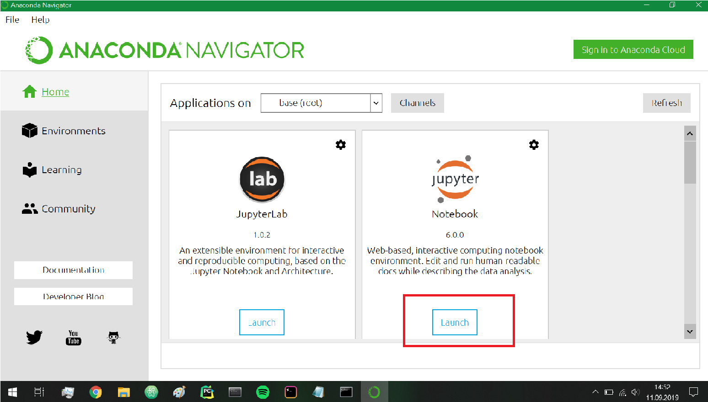
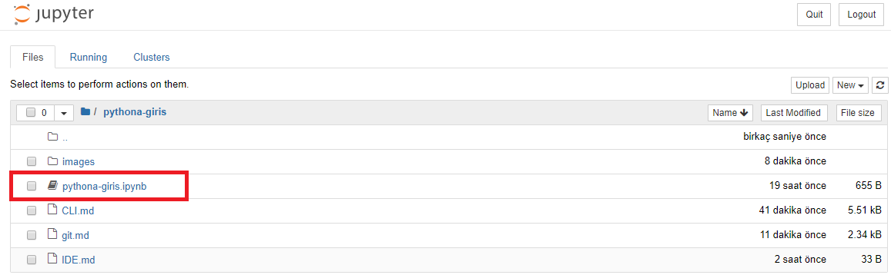

# Jupyter Notebook

Jupyter Notebook'u kullanmak için **Anaconda Navigator**'u veya **Anaconda Prompt**'u kullanabilirsiniz.

## Anaconda Navigator

1. Anaconda Navigator'u açınız.

> Anaconda Navigator'un açılması uzun sürebilir.

2. Jupyter Notebook yazısının altında bulunan **Launch** tuşuna tıklayınız.



3. Jupyter Notebook varsayılan internet tarayıcısı programınızda açılacaktır.
4. Açılan sayfada klasörlere tıklayarak Jupyter Notebook dosyalarınızın bulunduğu dizine girebilirsiniz.

## Komut İstemi
1. Anaconda Prompt'u açınız.
2. Jupyter Notebook'larınızın olduğu dizine gitmek için **cd** komutunu kullanınız.

> Bu adımı atlarsanız Anaconda Navigator'la olduğu gibi, açılan sayfadaki klasörlere tıklayarak dosyalarınızın olduğu dizine erişebilirsiniz.

```
cd Documents\ileri-bilgisayar-programlama
```

3. Aşağıdaki kodu çalıştırarak Jupyter Notebook'u açabilirsiniz.
```
jupyter notebook
```

4. Jupyter Notebook varsayılan internet tarayıcısı programınızda açılacaktır.
5. Açılan sayfada klasörlere tıklayarak Jupyter Notebook dosyalarınızın bulunduğu dizine girebilirsiniz.

## Ders Dosyalarını Kullanma

Jupyter Notebook internet tarayıcısında açıldıktan sonra **pyhtona-giris** klasörüne tıkladığınızda bir tane Jupyter Notebook göreceksiniz.



1. **pythona-giris.ipynb** dosyasının üzerine tıklayınız.
2. Yeni bir tabda bu defter açılacaktır.
3. Komut satırlarını çalıştırmak için kodunuzu yazdıktan sonra **shift + enter** tuşlarına basarak kodun çalışmasını sağlayabilirsiniz.
4. Çalışan kodun sonucu bir alt satırda gözükecektir.
5. Defteri kapatmak için **File>Close and Halt** sırasını izlemeniz gerekmektedir.
6. Jupyter Notebook'u tarayıcınızda kapattığınızda açık olan Anaconda Prompt programını da kapatabilirsiniz.

> Anaconda Prompt'u önce kapatırsanız, Jupter Notebook sayfasını kullanamazsınız.
