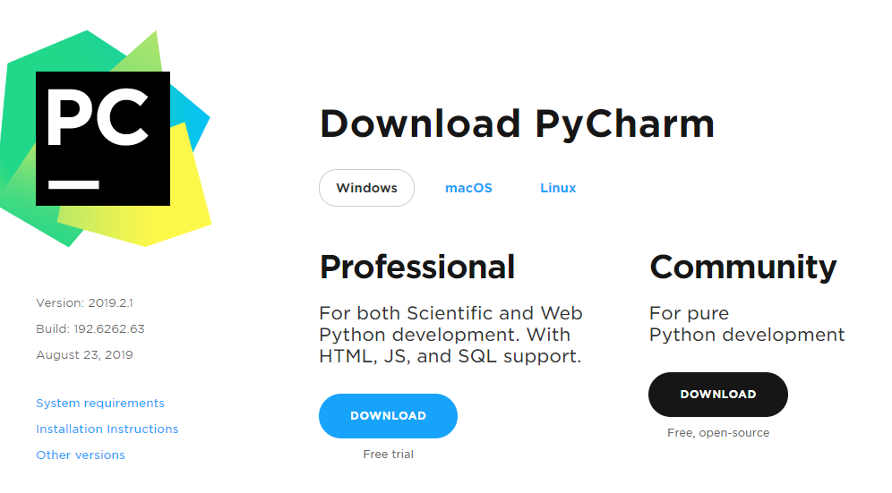

# PyCharm Kurulumu

Bu derste çoğunlukla **Jupyter Notebook** kullanılacaktır; ancak yazdığımız kodları tekrar tekrar kullanabilmemiz için bir geliştirme ortamına (IDE) ihtiyaç vardır.

İsterseniz Anaconda 3 ile birlikte gelen **Spyder 3** IDE'sini (Interactive Development Environment) kullanabilirsiniz. Bu şekilde bilgisayarınıza yeni bir program kurmanız gerekmeyecektir.

İsterseniz başka bir Python IDE'si olan **PyCharm**'ı kurmayı tercih edebilirsiniz. PyCharm ücretli bir program olmasına rağmen öğrenci bilgilerinizi girerek bütün özelliklerini ücretsiz olarak kullanabileceğiniz bir programdır. Öğrenci olduğunuz her sene üyeliğinizi yenileyerek ücretsiz kullanmaya devam edebilirsiniz.

> Spyder IDE bu derste göreceğimiz uygulamalar açısından tamamen yeterlidir. PyCharm'ı kurmanız şart değildir.

Kurulum için işletim sisteminize uygun olan adımları takip ediniz.

## Windows

1. [JetBrains Websitesi](https://www.jetbrains.com/pycharm/)'ni açınız.
2. **Download** linkine tıklayınız.

3. İşletim sisteminiz doğru seçili değilse **Windows** linkine tıklayınız.
4. Eğer öğrenci aktivasyonu yapacaksanız **Professional** sürümünü, yapmayacaksanız **Community** sürümünü indiriniz.

> Sadece python kullanacağımız için communnity sürümü de yeterli olacaktır.

> Community sürümü yaklaşık 250MB ve Professional sürümü 350MB olduğundan bağlantı hızınıza göre indirme süresi değişiklik gösterebilir.

5. Kurulum dosyası indikten sonra üzerine tıklayarak kurulum programını başlatınız. Karşılama ekranını **Next** tuşuyla geçiniz.
6. Kurulum dizin adresini değiştirmeyiniz.
7. Kısayol oluşturmak için bilgisayarınızın 32-Bit veya 64-Bit kontrolünü yaparak seçiniz ve kurulumu tamamlayınız.

### PyCharm İlk Açılış

* İstedğiniz temayı seçiniz.
* Ek program kurmanıza gerek yok.
* İlk açılışta sizden yeni bir proje oluşturmanızı isteyecektir. Aşağıdaki adımları izleyerek yeni proje dosyasını oluşturabilirsiniz:

1. İstediğiniz bir dizine (örn: Belgelerim) yeni bir klasör oluşturup, isimlendirin (örn: yeni-proje)

> İsimlendirmeleri yaparken sadece İngilizce karakterleri kullanmanız faydalı olacaktır.

2. **Location** satırının en sonunda bulunan klasör simgesine tıklayarak, oluşturduğunuz proje klasörünü seçin.
3. **Location** yazısının hemen altında bulunan **Project Interpreter** satırının başındaki ok işaretine tıklayarak açılmasını sağlayın.

4. Alttaki seçenek olan **Existing Interpreter** seçeneğini işaretleyin.

> İlk açılışta existing interpreter altında seçebileceğiniz liste boş olacaktır. Daha sonraki projelerde bu adımları tekrarlamanız gerekmeyecek.

5.  **Interpreter** satırının en sonunda bulunan dişli simgesine tıklayın.
6. Açılan yeni pencerede sol menüden **System Interpreter**'ı seçin.

7. Bu penceren Anaconda3 dizinini bulup, bu dizinde bulunan **python.exe** dosyasını seçmelisiniz. Eğer listede Anaconda3'ün bulunduğu dizini göremiyorsanız, elinizle yazarak bu dizine erişebilirsiniz. **python.exe** satırını seçtikten sonra **OK** ile kaydedin.

8. **Interpreter** satırında listeyi açıp eklediğimiz interpreterı seçin.

9. **Create** tuşuna tıklayın.

> PyCharm ilk açıılışta indexleme işlemi yapmaktadır ve bu uzun sürmektedir. PyCharm'ın en altındaki durum çubuğundan bu işlemin bitip bitmediğini takip edebilirsiniz. Bu işlem bitmeden PyCharm üzerinde herhangi bir işlem yapmayınız. Indexleme işlemi ilk yüklemeden sonra bir kez yapılmaktadır. Daha sonraki proje oluşturmak bu kadar uzun sürmeyecektir.
