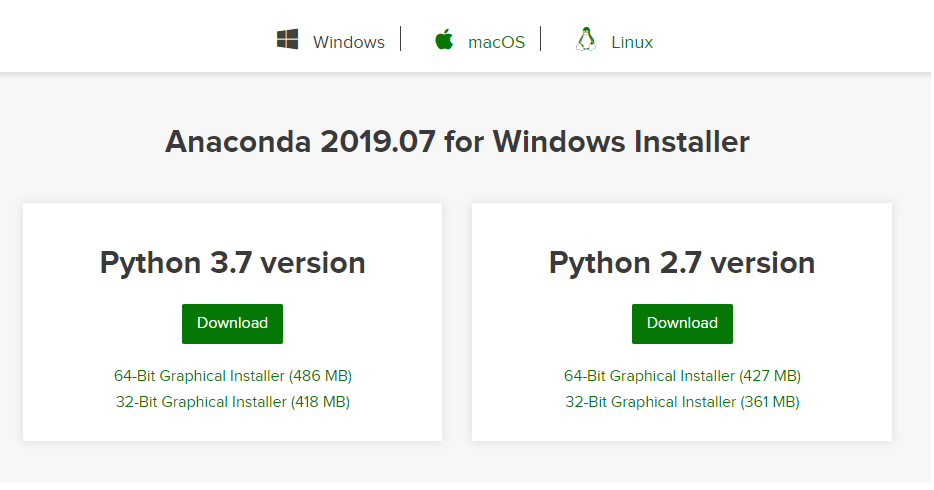
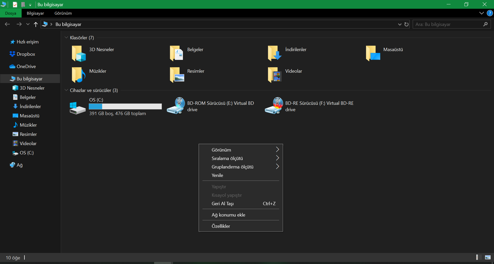
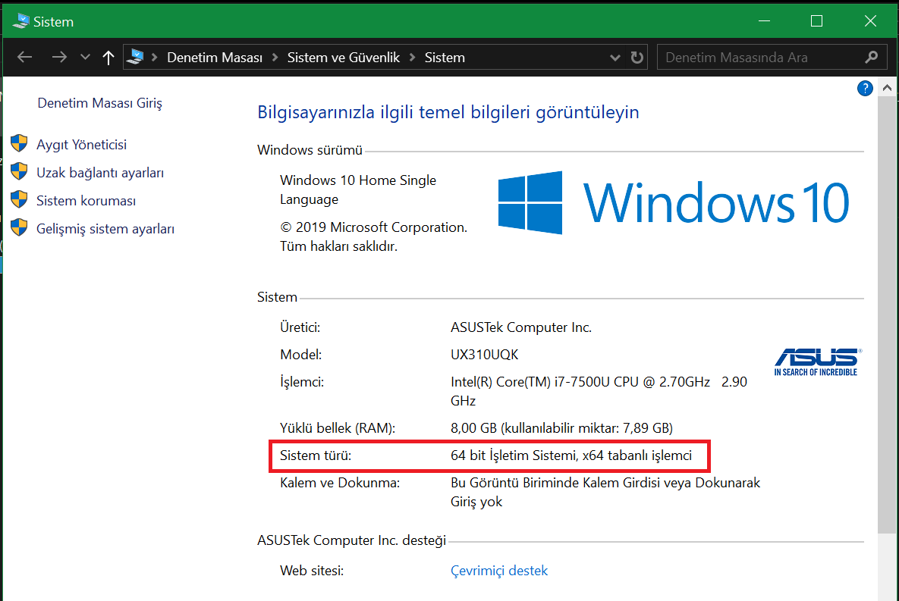
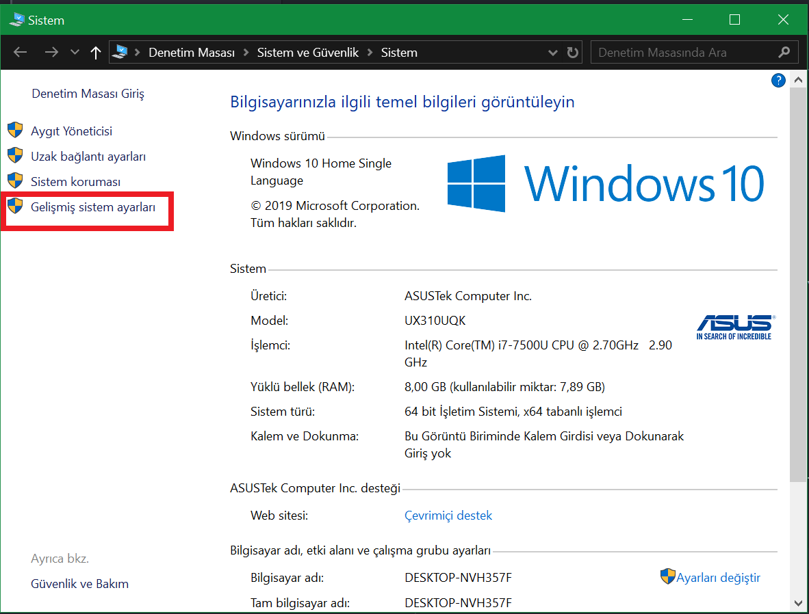
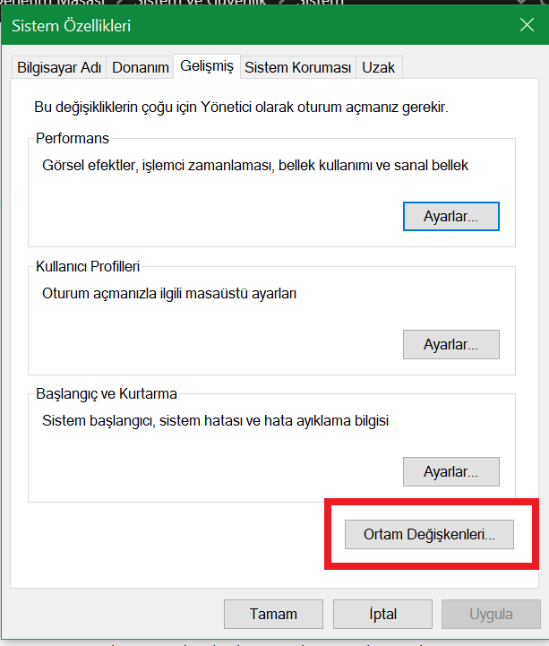
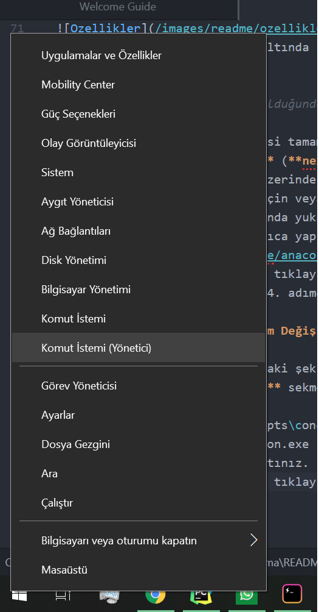
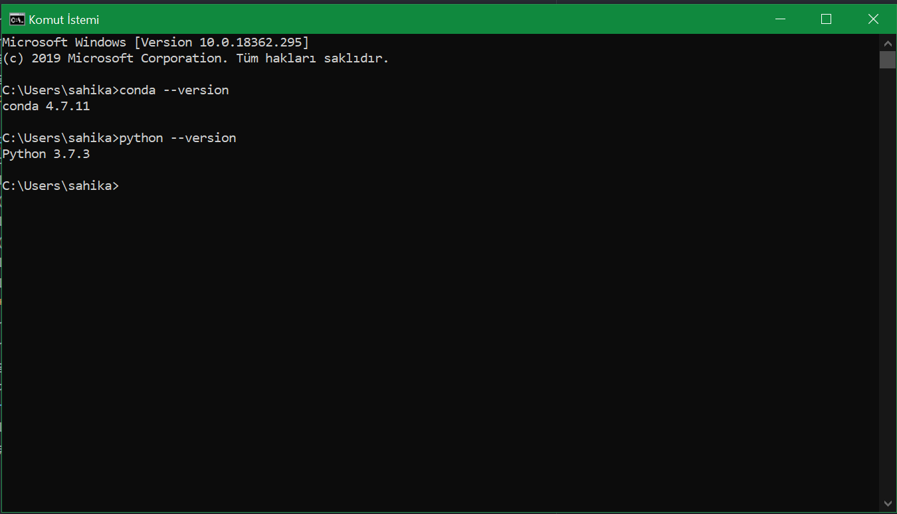
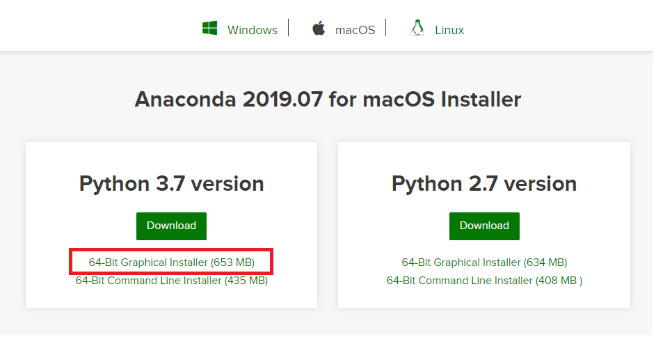
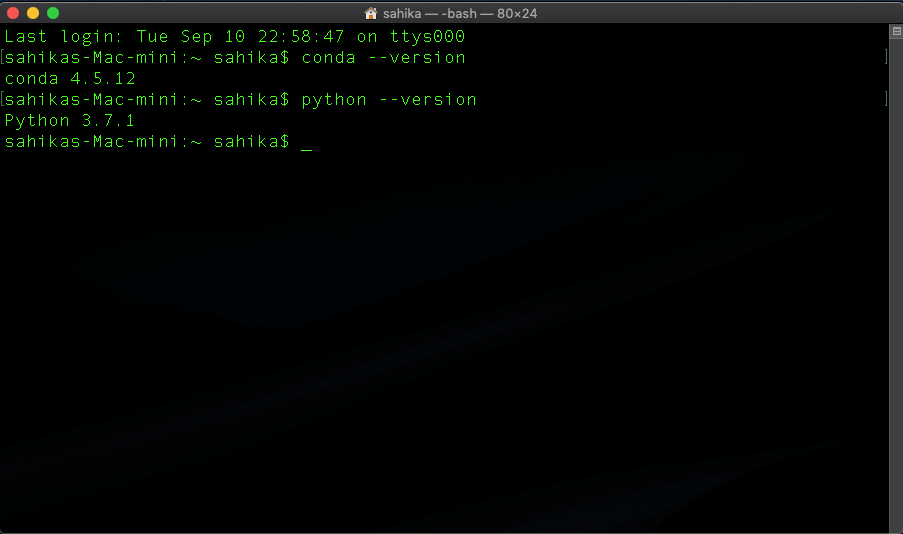

# Python Kurulumu

Bu dersi takip edebilmek, ders notlarını görebilmek ve verilen uygulamaları yapabilmeniz için bilgisayarınıza Python kurulumunu yapmanız gerekmektedir.

Kurulum için işletim sisteminize uygun olan adımları takip ediniz.

## Windows

 1. [Anaconda Websitesi](www.anaconda.com) adresini açınız.
 2. Üst menüden **Download** sekmesine tıklayınız.
 3. Açılan yeni sayfada **Anaconda 2019.07 for Windows Installer** yazmıyorsa, üst kısımda **Windows** linkine tıklayınız.

 > Bu kurulumu gerçekleştirdiğiniz tarihe bağlı olarak **Anaconda 2019.07** yerine daha ileri bir sürümü belirten farklı bir numara olabilir. Bu durumda kurulum aşamaları değişmemektedir. Sadece en güncel sürümü yüklüyor olacaksınız.

  

 4. Bilgisayarınızın 32-Bit veya 64-Bit olduğunu öğrenmek için aşağıdaki adımları takip ediniz.
  * **Bilgisayarım** veya **Bu Bilgisayar** klasörünü açınız.
  * Klasörün boş bir noktasına sağ tıklayıp, özellikler menüsünü seçiniz.

  

  * Yeni açılan pencerede **Sistem Türü** karşısında bilgisayarınızın 32-Bit mi 64-Bit mi olduğunu öğrenebilirsiniz.

  

 5. **Python 3.7 version** nun altında kalan yükleyicilerden (Installer) bilgisayarınıza uygun olana tıklayıp, dosyanın bilgisayarınıza indirilmesini bekleyiniz.

 > Dosya boyutu yaklaşık 500MB olduğundan bağlantı hızınıza göre indirme süresi değişebilir.

 6. Kurulum dosyasının indirilmesi tamamlandıktan sonra üzerine tıklayıp kurulum programını çalıştırınız.
 7. Kurulum programında **ileri** (**next**) tuşuyla ilerlerken aşağıdakilere dikkat ediniz.

  * Programın kurulacağı dizin üzerinde değişiklik yapmayınız. **Bu dizini bir yere not ediniz!** İleride kullanacağız.
  * Programı **sadece benim için (Just Me)** tercihiyle yükleyiniz.
  * **Advanced Options** aşamasında yukarıdaki **Add Anaconda to my PATH environment variable** kutucuğu **İŞARETSİZ** bırakılmalıdır. Bununla ilgili işlem kurum tamamlandıktan sonra ayrıca yapılacaktır.

  

8. Son olarak **Install** tuşuna tıklayıp, kurulumun tamamlanmasını bekleyiniz.
9. Kurulum tamamlandıktan sonra 4. adımdaki işlemleri tekrarlayarak **Sistem** ekranını açınız ve sol menüdeki **Gelişmiş Sistem Ayarlarına** tıklayınız.

10. Açılan yeni pencerede **Ortam Değişkenleri** menüsünü açınız.

11. Açılan yeni pencerede aşağıdaki şekilde mavi ile işaretlenmiş **Path** değişkenini seçip **Düzenle** menüsüne tıklayınız.
12. Açılan yeni pencerede **Yeni** sekmesini seçip aşağıdaki dizinleri tam olarak yapıştırınız. **Tamam**'a basıp kaydediniz. Geri kalan pencerelerde de **Tamam**'a basarak çıkınız.
 * C:\ProgramData\Anaconda3\Scripts
 * C:\ProgramData\Anaconda3
13. Bilgisayarınız yeniden başlatınız.
14. Windows Başlat simgesine sağ tıklayıp **Komut İstemi** veya **Komut İstemi (Yönetici)**'sini seçiniz.

15. Açılan ekrana **conda --version** yazıp enter'a basınız. Sonra da **python --version** yazıp enter'a basınız. Aşağıdaki gibi bir görüntüyle karşılaşıyorsanız kurulumu başarıyla tamamlamışsınız demektir. Tebrikler! 🎉

## MACOS
1. [Anaconda Website](www.anaconda.com) adresini açınız.
2. Üst menüden **Download** sekmesine tıklayınız.
3. Açılan yeni sayfada **Anaconda 2019.07 for macOS Installer** yazmıyorsa, üst kısımda **macOS** linkine tıklayınız.

> Bu kurulumu gerçekleştirdiğiniz tarihe bağlı olarak **Anaconda 2019.07** yerine daha ileri bir sürümü belirten farklı bir numara olabilir. Bu durumda kurulum aşamaları değişmemektedir. Sadece en güncel sürümü yüklüyor olacaksınız.

 

4. **Python 3.7 version** nun altında kalan yükleyicilerden (Installer) **64-Bit Graphical Installer**'a tıklayıp kurulum dosyasını indiriniz.

 > Dosya boyutu yaklaşık 650MB olduğundan bağlantı hızınıza göre indirme süresi değişebilir.

5. İndirme işlemi tamamlandıktan sonra üzerine tıklayıp kurulum programını çalıştırınız.
6. Herhangi bir değişiklik yapmadan **Continue** (**Devam**) tuşuna basarak ilerleyiniz.

