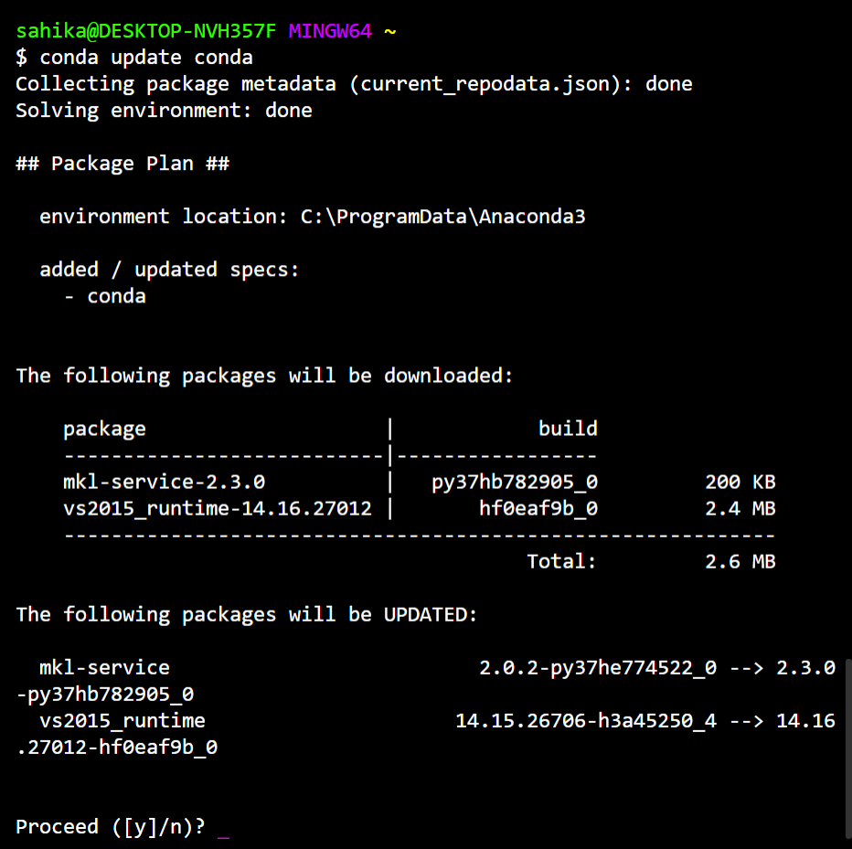

# Command Line Interface (CLI)
>Komut İstemi Arayüzü
## CLI Nedir?

**CLI** işletim sistemi özelliklerini kullanmak için kullanıcının girdi oluşturmasını sağlayan bir programdır.

Görsel arayüzü kullanımı CLI ile yapabileceğimiz işlemleri kolaylaştırır ve bazı güvenlik önlemleri oluşturur.

Örneğin görsel arayüzü kullanarak;
* Bir klasördeki gizli dosyaları özel ayar yapmadan göremezsiniz.
* Uyarı almadan dosya veya klasör silemezsiniz.
* Dosyaların uzantılarını özel ayar yapmadan göremezsiniz.

## CLI'yi Neden Kullanacağız?

Peki görsel arayüz komut isteminin yaptığı her işlemi yaptığı her işlemi, güvenlik uyarıları vererek sağlıyorsa neden komut istemini kullanacağız?

Ders boyunca kullanacağımız **Jupyter Notebook** uygulamasını başlatmak ve yönetmek komut istemi yöntemiyle daha kolay olduğu için komut istemini kullanmayı tercih edebilirsiniz.

> Jupyter Notebook kullanımıyla ilgili ayrıntılı bilgi [jupyter notebook kullanımı](jupyter-notebook-kullanımı.md) dosyasında verilecektir. Bu belgede komut istemiyle yapabileceğimiz bazı temel işlemler anlatılacaktır.

## Windows CLI ve Hyper Terminal

Windows CLI, **DOS** adı verilen bir sistem üzerinden çalışmaktadır.

Hyper Terminal ise [kurulum dosyasında](hyper-kurulumu.md) gösterildiği gibi bütün işlemleri yaptıysanız **bash** adı verilen bir sistem üzerinden çalışmaktadır.

Bu iki sistem temelde aynı işlemleri yapsa da bazı komutlar farklılık göstermektedir. Burada anlatılacak bütün komutlar iki sistem üzerinden de gösterilecektir.

## CLI İşlemleri

### Change Directory (Dizin Değiştirme)

Bu komut iki sistemde de **cd** olarak kullanılır. Örneğin, Belgelerim klasörüne ulaşmak için fareyle klasörün üzerine çift tıklayarak yaptığımız işlemi komut istemiyle yapmak için **cd** komutunu kullanmamız gerekiyor.

Komut istemini kullanarak Belgelerim klasörüne erişmek için aşağıdaki kodu yazıp enter'a basmamız gerekmektedir:

```
cd Documents
```
Her seferinde tek bir klasörün adını yazarak dizinde ilerleyebileceğiniz gibi, dosyanın bulunduğu klasörün dizinini biliyorsanız bir kerede aşağıdaki gibi yazabilirsiniz.

> Windows CLI ve Hyper dizin adreslerinde klasörleri farklı şekilde ayırmaktadır. Hangi komut istemini kullanıyorsanız ona uygun verilen örnekteki gibi yazdığınızdan emin olunuz.

**Windows CLI**
```
cd Documents\ileri-bilgisayar-programlama
```
**Hyper Terminal**
```
cd Documents/ileri-bilgisayar-Programlama
```

Bu kodları çalıştırdığınızda satır başında gözüken adresin değiştiğini görebilirsiniz. Bu satırda en sonda hangi klasör adı varsa o klasörün içindesiniz demektir.

Bir üst klasöre çıkmak için aşağıdaki kodu kullanmanız gerekmektedir:

**Windows CLI**
```
cd ..
```
**Hyper Terminal**
```
cd ..
```

En üst dizine gitmek içins aşağıdaki kodu kullanmanız gerekmektedir:

**Windows CLI**
```
cd \
```
**Hyper Terminal**
```
cd ~
```

> Windows CLI'de en üst dizin harddisktir. (genellikle C:\\) Buradan tekrar Belgelerim klasörüne gelmek isterseniz önce kullanıcılar (Users) klasörüne sonra kendi kullanıcı klasörünüze (kullanıcı-adı) girdikten sonra Belgelerim'e ulaşabilirsiniz.

```
cd Users\kullanici-adiniz\Documents
```

> Hyper Terminal ise en üst dizin olarak sizin kullanıcı klasörünüzü kullanmaktadır. Dolayısla Belgelerim klasörüne doğrudan ulaşabilirsiniz.

```
cd Documents
```
### Dizindeki Dosya ve Klasörleri Listeleme

Arayüzü kullanarak bir klasör açtığınızda içindeki bütün klasör ve dosyalar ekranınızda gözükür. Komut istemiyle bir klasörün içine girdiğinizde ise eğer siz istemezseniz, bu klasörün altındaki dosya ve diğer klasörleri göremezsiniz.

Bir dizindeki (klasör) dosya ve klasörleri listelemek için aşağıdaki komutlar kullanılır.

**Windows CLI**
```
dir
```

**Hyper Terminal**
```
ls
```

Komut istemiyle kullanabileceğiniz daha birçok komut olsa da bu ders kapsamında kullanacağımız komutlar bu ikisi olduğundan, diğer komutlarla ilgili bilgi edinmek için linkteki yazıyı [okuyabilirsiniz.](https://www.w3schools.com/whatis/whatis_cli.asp)

## Anaconda ve Python Kütüphanelerini Güncelleme

**Anaconda Promt** programını kullanarak Anaconda ve python kütüphanelerinizi aşağıdaki şekilde güncelleyebilirsiniz. Anaconda Prompt'u başlat altında bulabilirsiniz.

> Güncelleme işlemleri sırasında hata alıyorsanız Anaconda Prompt u açarken sağ tıklayıp Yönetici Olarak Çalıştır'ı seçiniz.

**Conda'yı Güncellemek**
Conda, Anaconda ile birlikte gelen ve yeni kütüphane yüklemek veya mevcut kütüphaneleri güncellemek için kullanacağımız bir programdır.

Condayı güncellemek için:

```
conda update conda
```


Eğer güncellenecek dosyalar varsa yukarıdaki şekildeki gibi **Proceed ([y]/n)** yazısını göreceksiniz. Güncellemeleri yapmak için **y** tuşuna basıp enter'a basınız.

**Anaconda'yı Güncellemek**
Anaconda'yı güncellemek için aşağıdaki kodu yazıp condayı güncellerken yaptığınız işlemler gibi devam ediniz.

```
conda update anaconda
```

**Conda ile Kütüphane Yükleme**

```
conda install kutuphane-adi
```
