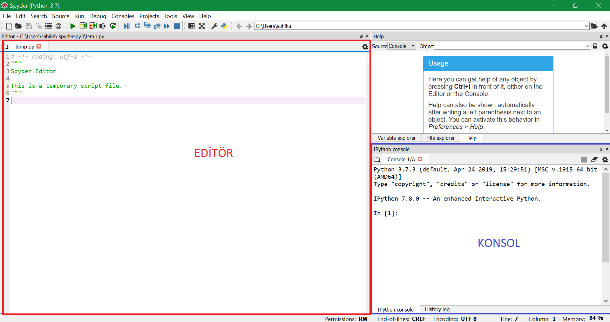
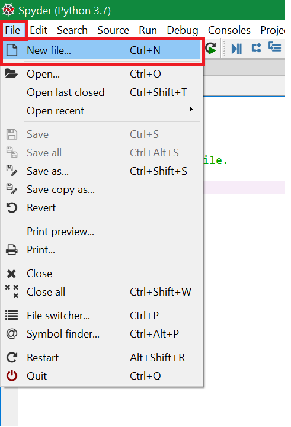
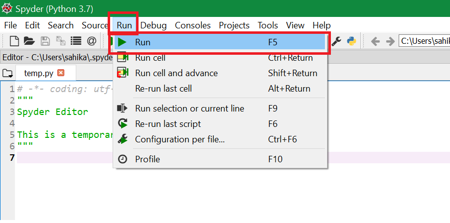
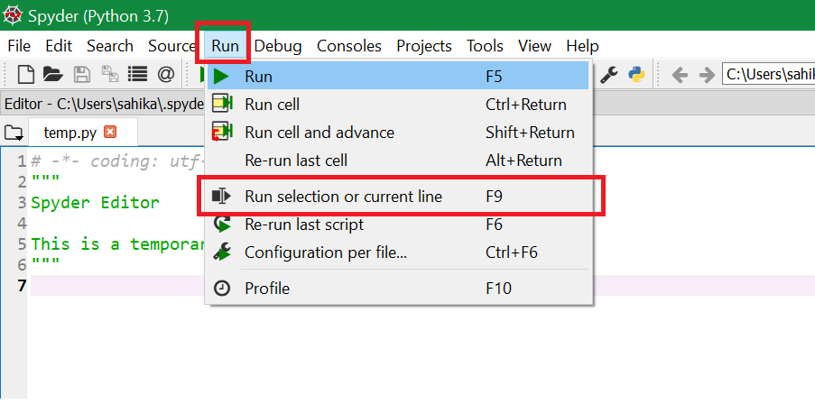
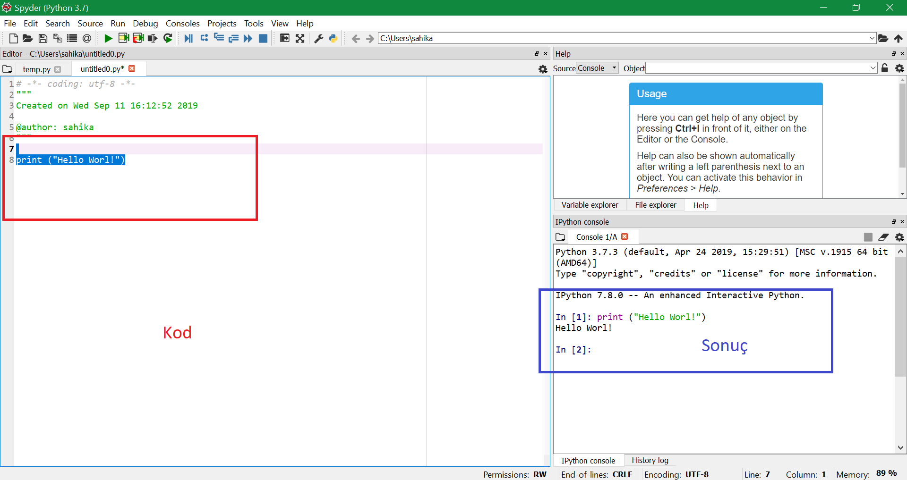
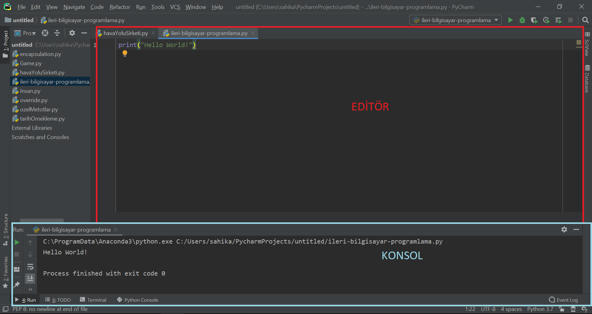
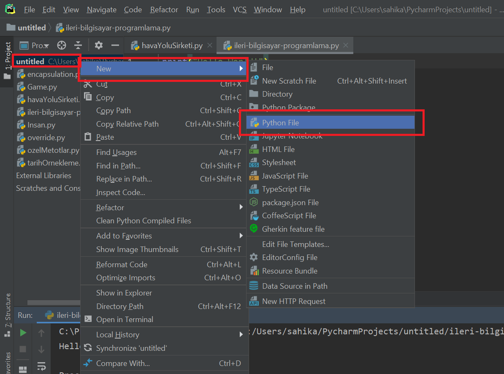
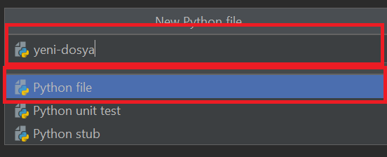
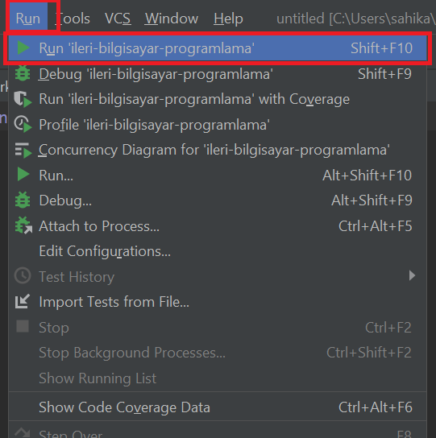
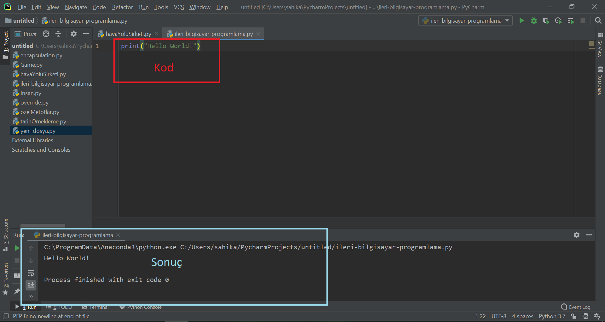

# Interactive Development Environment

Bu yazıda Python için Interactive Development Environment (IDE) olan **Spyder** ve **PyCharm** kullanımıyla ilgili genel bilgileri bulabilirsiniz.

## Spyder

Spyder'da çalışırken kodu şekilde **editör** olarak işaretlenen alanda yazacağız.

Yazdığımız kodların sonuçlarını ise **konsol** olarak işaretlenen alanda göreceğiz.

### Yeni dosya açma

> File>New File

### Kodu çalıştırma
Bütün kodu çalıştırmak için:

> Run>Run

> F5 tuşu

Kodun belirli bir bölümünü çalıştırmak için:
> Çalıştırmak istediğiniz kod bölümünü seçtikten sonra
Run>Run Selection

> F9 tuşu

### Sonuçların görüntülenmesi

Kodunuzu editöre yazdıktan sonra yukarıda anlatılan iki şekilden birine göre çalıştırdığınızda aşağıdaki gibi bir ekran görmelisiniz.

## PyCharm

PyCharm'da çalışırken kodu şekilde **editör** olarak işaretlenen alanda yazacağız.

Yazdığımız kodların sonuçlarını ise **konsol** olarak işaretlenen alanda göreceğiz.

> PyCharm'da kod çalıştırılmadan önce konsol alanı açılmamış olabilir.

### Yeni dosya açma

Sol menüde görünün proje dosyanıza sağ tıklayıp, açılan menüden New>Python File 'ı seçiniz.

Açılan alana dosya adını giriniz ve **enter** tuşuna basınız.

### Kodu çalıştırma
Bütün kodu çalıştırmak için:

> Run>Run 'dosya adi'

> Shift + F10

> Alt + Shift + F10

### Sonuçların görüntülenmesi

Kodunuzu editöre yazdıktan sonra yukarıda anlatılan iki şekilden birine göre çalıştırdığınızda aşağıdaki gibi bir ekran görmelisiniz.

