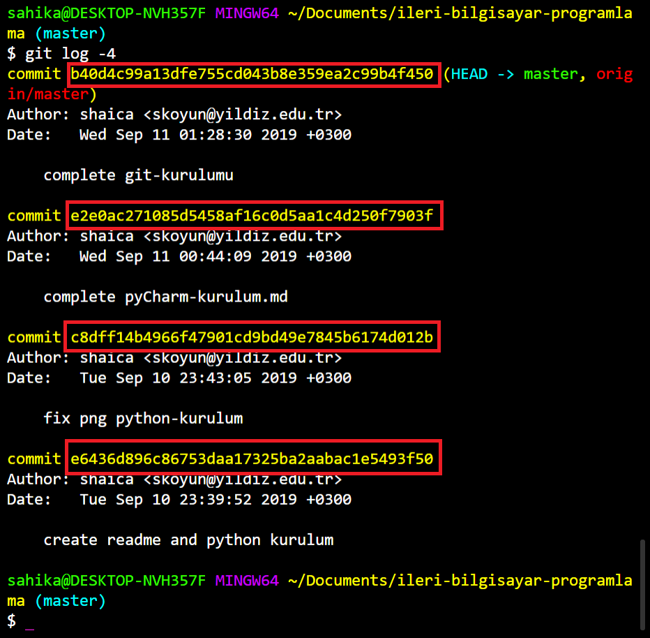

# Git Kullanımı

Hyper Terminal'i açtıp git işlemlerine başlayabilirsiniz.

## git init

1. Versiyon takibini yapmak istediğiniz klasöre dizinine giriniz.

```
cd Documents/ileri-bilgisayar-programlama
```

2. Aşağıdaki kodu kullanarak versiyon takibini başlatınız.

```
git init
```

## git status

```
git status
```

Bu komutla takibini yaptığınız dosyalardaki değişiklikleri takip edebilirsiniz. Bu komutu çalıştırdıktan sonra komut istemi ekranında hangi dosyalarda değişiklik yapıldığı, hangi dosyaların eklendiği, silindiği vb bilgiler yazdırılıcaktır.

## git add

Yaptığınız değişiklikleri versiyon kontrolüne kaydetmeden önce **add** komutunu kullanarak, kaydedilecek olduklarını işaretlemeniz gerekmektedir.

Yapılan bütün değişiklikleri işaretlemek için:
```
git add .
```

Belirli bir dosyayı işaretlemek için:
```
git add dosyaAdi.dosyaUzantisi
```

## git commit

Kaydedilmek üzere işaretlenen dosyaları versiyon kontrolüne kaydetmek için aşağıdaki **commit** kodunu kullanmanız gerekmektedir.

>Commit komutuyla commit mesajı eklemezseniz işlem tamamlanmaz.

```
git commit -m "Tırnak içine commit mesajınızı yazınız."
```

## git log

Yaptığınız commit işlemlerinin takibi için bu komutu kullanmalısınız.

```
git log
```

## git checkout

Önceki bir sürüme dönmek istiyorsanız aşağıdaki şekilde yapmalısınız.

1. Dönmek istediğiniz sürümün id'sini bulma: (-'den sonra gelen sayı gösterilecek kayıt miktarını belirtir.
>Aşağıdaki örnekte son 4 kayıtın gösterilmesi belirtiliyor.)

```
git log -4
```



Bu kodu çalıştırdıktan sonra listelenen satırlarda yaptığınız commit işlemlerini, bu işlemlerin id'lerini, commit eden kişiyi, commit tarihini ve commit mesajını görebilirsiniz. Yukarıdaki şekilde kırmızıyla işaretlenen alanlar commit id'leridir.

2. Dönmek istediğiniz commit id'sini fareyle seçip, sağ tıklayarak kopyalabilirsiniz.
3. Aşağıdaki kodu çalıştırarak istediğiniz kaydetme noktasına (commit) dönebilirsiniz.
```
git checkout <commitID>
```

4. En son versiyona dönmek için aşağıdaki kodu çalıştırınız.

```
git checkout master
```
